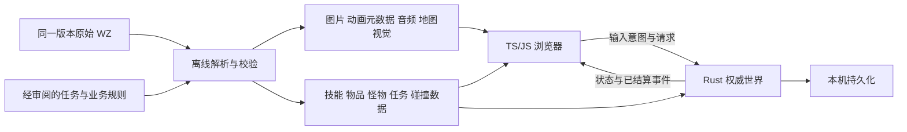

# 前后端通用技术方案（审查草案）

更新：2026-09-05。已确认：经典端游冒险岛、Web TypeScript / JavaScript 前端、Rust 后端、单主机服务、局域网多设备不同账号、先运行后性能优化、组件组合与模块化。实现已开始，实际接口见 shared/protocol.ts；首版 GMS83 蘑菇村 000010000；首版范围已确定，见第 8 节。

## 1. 共同边界

浏览器负责输入、画面、UI、动画与声音；Rust 服务端负责世界状态、角色归属、移动与碰撞的最终判定、技能命中、伤害、掉落、任务及存档。两端共用稳定的内容 ID、资源清单、数据定义和消息契约，不要求共用一种编程语言或同一 ECS。

前端可以立即播放本地动作反馈、插值远端角色；HP、MP、EXP、物品、冷却、任务状态以服务端结果为准。每种状态只设一份权威数据：Phaser / Pixi 对象是呈现对象，不能再成为另一份玩法状态库。

图中 Content 表示同一构建来源；前端只取显示和预测需要的字段，后台业务配置不必全部发送。资源文件走 HTTP，实时游戏消息走 WebSocket。建议一台 Rust 服务同时提供网页 / 静态资源 / API / WebSocket；开发时可让前端开发服务器代理 API，避免客户端配置多套局域网地址。

## 2. 消息契约建议

建议 MVP 从带 `type` 判别字段的 JSON 消息开始，便于浏览器开发工具观察；暂不兼容原版二进制协议，不增加旧 TCP 转发层。WebSocket 可用 [axum 官方模块](https://docs.rs/axum/latest/axum/extract/ws/)。序列化格式以后只有实测需要时再改。

| 方向 | 消息类别（建议名） | 用途 / 权威边界 |
| --- | --- | --- |
| 客户端 → 服务端 | hello | 协议版本、内容包版本；身份来自已验证会话，不接受任意 accountId 作为认证 |
| 客户端 → 服务端 | enterWorld | 请求选择自己的角色；服务端核验角色归属 |
| 客户端 → 服务端 | input | 输入序号 seq、方向、跳跃 / 交互意图；不是上传可信位置或伤害 |
| 客户端 → 服务端 | useSkill | requestId、skillId、方向 / 瞄准；客户端目标最多作提示 |
| 客户端 → 服务端 | questAction / pickup | 请求接取 / 提交任务、拾取；服务端验证距离、状态和所有权 |
| 服务端 → 客户端 | welcome / snapshot | 会话结果、serverTick、mapId、完整可见状态、已处理输入序号 |
| 服务端 → 客户端 | entityUpdate / spawn / despawn | 变化后的实体状态；MVP 可先按地图广播，再按需要加可见区域筛选 |
| 服务端 → 客户端 | actionStarted / hit / loot / questUpdated | 已接受动作与已结算业务结果，携带事件 ID 及服务器时序 |
| 服务端 → 客户端 | rejected | 对应 requestId、稳定错误码、可读原因，客户端结束临时反馈 |

每个请求按会话验证长度、类型、枚举、数值范围与允许频率；未知消息拒绝，不能任意指定组件名、执行函数名或资源磁盘路径。客户端不上传最终伤害、道具数量或任务奖励让服务端照写。

`seq` 用于输入确认和纠正；`requestId` 用于识别离散请求。重发请求不能造成重复扣费 / 发奖。服务器时间使用单调时钟驱动 tick 与持续效果；浏览器时钟仅负责呈现。当前实现50ms tick与快照频率，属于首版默认，不是用户指定性能要求。

## 3. 共用 ID 与版本

| 概念 | 约定建议 |
| --- | --- |
| 静态内容 ID | mapId、itemId、mobId、npcId、skillId、questId 保留原始含义；WZ 路径与有前导零的文件名原样保存为字符串 |
| 运行时实体 ID | entityId 由服务端分配，与 mobId 这类模板 ID 区分；两只相同怪物是两个实体 |
| 角色 / 账号 | characterId 与 accountId 区分，绑定关系由后端会话核验 |
| 动作 / 特效实例 | actionInstanceId / effectInstanceId 标记本次施放或持续效果，用于结束、取消和去重 |
| 版本 | protocolVersion、contentVersion、资源 schemaVersion 分开；contentVersion 由 region + gameVersion + 原始包 hash + 导出版本固定 |

ID 表达形式在实现前一次选定并写入契约；涉及超过 JS 安全整数范围的 ID 使用字符串，禁止一端字符串另一端浮点数。前后端握手发现内容版本不同应明确阻止进入世界，不能把 v079、原版 v83、Cosmic 修改 v83、v153 UI 静默拼接。

共享契约建议集中为一份可读 JSON Schema / 消息定义，加少量两端都能读取的样例。TS 类型和 Rust serde 结构从相同规范建立；是否生成代码以后再定。至少留一个跨端契约检查，验证同一样例的字段、枚举和版本；不为此先建设大型代码生成系统。

## 4. 资源包与动画契约

原始 WZ 作为只读来源保留，来源 URL、SHA256、地区、版本与导出工具版本写入 manifest。运行时加载普通图片、音频和 JSON；初期无需浏览器直接解析 2 GB WZ，也无需启动后调用外部素材站。

| 数据 | 必须保留的内容 |
| --- | --- |
| 图片 / 图集 | 原始 Canvas 路径、尺寸、透明像素、导出文件 / 图集 frame；裁剪时同时保留偏移 |
| 动画 | 动作 ID、原帧序号、逐帧 delay、origin、帧引用；action/frame 重定向和 UOL / inlink / outlink 解析结果及原来源 |
| 纸娃娃 | body / head / 装备各部件、map 中 neck / navel / hand / brow 等命名锚点、z 与 Base.wz 的 zmap / smap、帽子 / 头发遮挡相关数据 |
| 技能视觉 | 人物动作、prepare / effect / ball / hit 等引用、出现时机与持续方式；只有技能图标不算技能动画 |
| 地图 | 背景 / 瓦片 / 物件及图层、视差 / 重复信息；另保留 foothold、梯子绳索、portal、life、地图边界与 BGM |
| 音频 | 原始路径、编码 / 容器、时长与可解码文件；保留 BGM / 音效映射，不能仅留 WZ 节点名 |
| 数值 / 文本 | 物品 / 怪物 / 技能等级 / 任务字段与 string 名称，保留单位和来源 |

动画时长与战斗结算时点相关但不能等同：美术帧 delay 不会自动提供完整命中规则。对原始数据缺省、负 delay、动作重定向、循环 / 结束策略必须明确记录解释，不能一律用固定 FPS 覆盖。资源缺失或引用循环应在离线校验时列出，而不是运行时静默空白。

导出先按地图及其依赖做可用包，同时保留完整底包。是否进一步合图集、分包、压缩与预加载以测量为依据。完整素材验收与首个 MVP 内容范围分开：只跑一张地图不能证明整个客户端素材已完整。

## 5. 技能、动作、效果与任务组合

建议用普通配置组合少量经过实现的行为，不为每个技能建一个继承类。

- **动作**：一次施放过程，拥有实例 ID、阶段 / 时序和取消规则；执行移动限制、播放姿态、在命中时点触发效果等步骤。
- **效果**：伤害、治疗、位移、投射物、状态增益等通用运算；伤害 / 命中 / 持续状态在后端决定，粒子 / 声音 / 镜头反馈由前端呈现。
- **组件**：实体当前拥有的数据，如位置、生命、外观、冷却、正在执行的动作、持续状态集合；临时组件 / 实例到期或取消后移除。
- **模块 / 插件**：工程启动时显式注册系统和行为类型的代码模块。它与游戏中“给角色临时挂一个效果”不同；暂无运行时热插拔需求。
- **任务**：条件 → 目标进度 → 完成奖励；配置复用通用条件与奖励动作，特殊任务才扩展明确的服务端行为。不直接执行第三方 JS 脚本。

新增一种现有机制的技能主要添加配置与资源映射；只有新增机制才改通用效果处理器。任务奖励要连同任务状态在同一持久化事务中提交，重发与重连不能重复发奖。

## 6. 错误、断线与生命周期

- 资源缺失、协议不兼容、账号失败分别给出明确状态，加载失败允许重试，不进入无限 loading。
- 断线后停止发送输入并显示连接状态；默认重新认证并请求权威 snapshot。不要无条件回放断线期间积攒的施放 / 拾取 / 任务提交。
- 服务端在断线时释放会话和输入状态；角色是否短暂保留、保留多久是待选策略。死亡、切图、断线、取消动作都必须结束对应临时效果 / 计时器 / 订阅。
- 浏览器动作实例拥有其临时 sprite、音效句柄和事件订阅；实例结束统一清理。共享纹理缓存不随单个实例销毁，以免影响其它实体。
- 慢连接的发送队列必须有界；可以丢弃可被新快照替代的过期位置更新，不能丢掉不可重建的业务结果而仍认为客户端已收到。MVP 可先让慢连接重连取全量状态。

## 7. 从参考源码得出的边界

| 实际证据 | 可借鉴内容 | 重写边界 |
| --- | --- | --- |
| DevenWen Phaser：`src/main.ts` → `DemoTileMap.ts` → `RPCWzStorge.ts` → `WzNode` / `AnimationLoader` | atlas 与 JSON 配合、帧 delay、UOL、动作映射、角色锚点 | 默认是 Tiled / Matter 测试场景，技能加载有空实现；不是现成完整客户端，也不能照搬 localhost URL 给局域网设备 |
| Maplewright：`crates/wz/src/paperdoll.rs`、`bin/wzmap.rs` | Base.wz/zmap、命名锚点、脚点、地图布局与 foothold 分离 | 地图烘焙样例不是完整动态场景管线；Rust/WASM 前端不替换用户已选 TS/JS |
| Cosmic：`QuestActionHandler` → `Quest.canStart/canComplete` → 条件 / 动作 | 任务门槛、前置任务、奖励与特殊脚本分类 | 不照抄 Java 继承树和旧协议；数据来自自定义 v83，须与选定底包逐项核对 |
| Cosmic：`SkillFactory` → `StatEffect`、`AbstractDealDamageHandler.parseDamage` | 技能等级数据、通用效果与例外规则 | 旧 handler 读取客户端 damage 后检查；新服务端应自主结算，不能把客户端结果当权威 |
| Maplewright：`crates/wsproxy/src/main.rs` | 说明旧客户端为什么要 WebSocket → TCP 代理 | 自建前后端不需要兼容该旧字节协议与多端口迁移机制 |

对应仓库与固定提交见 `references/evidence/repository-inventory.json`。此处是源码审核与方案建议，没有运行第三方游戏，没有声称这些 demo 已可完整联机。

## 8. 已确认首版 MVP 与分阶段验收

范围：两个及多个不同账号、一张地图、局域网在线联机、移动和角色普攻。具体地图、机器人路线与节奏待实施配置。

- 开发自测：两个自动化机器人账号走真实登录与联机链路，以正常客户端输入 / 普攻请求交给同一 Rust 规则处理，验证身份独立、同图互见、移动与普攻同步。
- 用户验收：提供登录界面及完整进入地图流程；用户自行登录，在同一地图看到一个独立机器人账号自动执行程序化动作。机器人不依赖 AI 实时操控，不绕过协议直接修改世界。
- 两阶段分别保留记录，开发双机器人通过不能替代用户验收。首版不增加技能、任务、掉落、PVP 门槛；本文相关设计是后续扩展边界。

当前已创建 Web/Rust 实现，构建通过，网络与代表性浏览器开发验收已通过，用户验收待执行。可操作条件、证据要求和未验收状态以验收标准为准。

文档导航：[计划](PLAN.md) · [前端](FRONTEND_ARCHITECTURE.md) · [后端](BACKEND_ARCHITECTURE.md) · [验收标准](ARCHITECTURE_ACCEPTANCE.md) · [参考项目分级](REFERENCE_PROJECTS.md)

## 本地审核证据

本仓库内的证据：[固定提交与资源统计](references/evidence/repository-inventory.json)（可直接打开）。

以下三处属于**参考仓库，不随本仓库分发**：`参考/repos/` 需按 [参考项目分级](REFERENCE_PROJECTS.md) 自行浅克隆后才会出现，路径为克隆后的规范位置。

| 证据 | 克隆后的相对位置 | 上游 |
| --- | --- | --- |
| 纸娃娃锚点和 zmap | `参考/repos/Sheilem__maplewright/crates/wz/src/paperdoll.rs` | [Sheilem/maplewright](https://github.com/Sheilem/maplewright) |
| 地图烘焙及 foothold | `参考/repos/Sheilem__maplewright/crates/wz/src/bin/wzmap.rs` | 同上 |
| 任务条件与动作 | `参考/repos/P0nk__Cosmic/src/main/java/server/quest/Quest.java` | [P0nk/Cosmic](https://github.com/P0nk/Cosmic) |

## 当前实现决定

用户已确认单一权威逻辑拥有者顺序推进世界。网络只投递有界消息，认证/数据库在独立串行worker。当前50ms tick是实现默认，可配置策略仍须基于实测；本版不做分片、并行模拟或分布式，未来先讨论。普攻只同步动作，实际swingO1原始delay总800ms，不添加受击对象。
