# 风铃桥／岛：文案分支与行为树图册

从实际叙事 JSON 自动生成；用于内容审阅，不是游戏已经执行这些规则的证明。完整条件、效应、对白和重放边界以 [叙事数据](../../../resources/scenes/windbell/narrative/) 为准。

刷新命令：`python3 scripts/creative/build_windbell_trees.py`。

## dialogue.windbell.cart.first_encounter

```mermaid
flowchart TD
  n0["branch: dlg.cart.entry"]
  n0 -->|"其他情况"| n4
  n0 -->|"{&quot;fact&quot;:&quot;session.windbell.cart.last_outcome&quot;,&quot;op&quot;:&quot;eq&quot;,&quot;value&quot;:&quot;replayed&quot;}"| n15
  n0 -->|"{&quot;any&quot;:[{&quot;fact&quot;:&quot;world.windbell.bridge.cart.self_rescue.step&quot;,&quot;op&quot;:&quot;eq&quot;,&quot;value&quot;:&quot;bandaged&quot;},{&quot;fact&quot;:&quot;world.windbell.bridge.cart.self_rescue.step&quot;,&quot;op&quot;"| n16
  n0 -->|"{&quot;fact&quot;:&quot;world.windbell.bridge.cart.pose&quot;,&quot;op&quot;:&quot;eq&quot;,&quot;value&quot;:&quot;tilted&quot;}"| n1
  n0 -->|"{&quot;all&quot;:[{&quot;fact&quot;:&quot;world.windbell.bridge.cart.pose&quot;,&quot;op&quot;:&quot;eq&quot;,&quot;value&quot;:&quot;upright&quot;},{&quot;fact&quot;:&quot;world.windbell.bridge.cart.cargo.secured&quot;,&quot;op&quot;:&quot;eq&quot;,&quot;value&quot;:fa"| n3
  n1["line: 车轮卡在沟沿，货还没全散。要搭哪一把手，由你自己定。"]
  n1 -->|"先看看情况"| n2
  n1 -->|"扶住车辕"| n5
  n1 -->|"扶住车辕：失败"| n14
  n1 -->|"递一条绷带"| n7
  n1 -->|"递一条绷带：失败"| n14
  n1 -->|"我替你看路"| n9
  n1 -->|"我替你看路：失败"| n14
  n1 -->|"先走一步"| n20
  n2["line: 我先把伤口压住，再把货绑好。车身若能站稳，后面的路就不用堵在这里。"]
  n2 -->|"扶车"| n5
  n2 -->|"扶车：失败"| n14
  n2 -->|"递绷带"| n7
  n2 -->|"递绷带：失败"| n14
  n2 -->|"接手看路"| n9
  n2 -->|"接手看路：失败"| n14
  n2 -->|"离开"| n20
  n3["line: 车身站住了，多谢搭手。货还没绑好，别急着把它当成已经能走。"]
  n3 -->|"替你看一会儿路"| n9
  n3 -->|"替你看一会儿路：失败"| n14
  n3 -->|"让你们自己收尾"| n20
  n4["line: 车已经能走了。我还要把这批货送到桥那边，你若赶路就先走。"]
  n4 -->|"点头离开"| n20
  n5["branch: dlg.cart.brace.result"]
  n5 -->|"其他情况"| n13
  n5 -->|"{&quot;fact&quot;:&quot;session.windbell.cart.last_outcome&quot;,&quot;op&quot;:&quot;eq&quot;,&quot;value&quot;:&quot;success&quot;}"| n6
  n5 -->|"{&quot;any&quot;:[{&quot;fact&quot;:&quot;session.windbell.cart.last_outcome&quot;,&quot;op&quot;:&quot;eq&quot;,&quot;value&quot;:&quot;replayed&quot;},{&quot;fact&quot;:&quot;session.windbell.cart.last_outcome&quot;,&quot;op&quot;:&quot;eq&quot;,&quot;value&quot;:&quot;alr"| n15
  n5 -->|"{&quot;fact&quot;:&quot;session.windbell.cart.last_outcome&quot;,&quot;op&quot;:&quot;eq&quot;,&quot;value&quot;:&quot;failed&quot;}"| n14
  n6["line: 先别松手……好了，车身站稳了。货还得绑好，但这一步是你搭出来的。"]
  n6 -->|"收手离开"| n20
  n7["branch: dlg.cart.first_aid.result"]
  n7 -->|"其他情况"| n13
  n7 -->|"{&quot;fact&quot;:&quot;session.windbell.cart.last_outcome&quot;,&quot;op&quot;:&quot;eq&quot;,&quot;value&quot;:&quot;success&quot;}"| n8
  n7 -->|"{&quot;any&quot;:[{&quot;fact&quot;:&quot;session.windbell.cart.last_outcome&quot;,&quot;op&quot;:&quot;eq&quot;,&quot;value&quot;:&quot;replayed&quot;},{&quot;fact&quot;:&quot;session.windbell.cart.last_outcome&quot;,&quot;op&quot;:&quot;eq&quot;,&quot;value&quot;:&quot;alr"| n15
  n7 -->|"{&quot;fact&quot;:&quot;session.windbell.cart.last_outcome&quot;,&quot;op&quot;:&quot;eq&quot;,&quot;value&quot;:&quot;failed&quot;}"| n14
  n8["line: 这下好呼吸多了。绷带是从车上的急救包取的，我记得你递到我手里。"]
  n8 -->|"让阿苇继续收车"| n20
  n9["line: 那就交给你一小会儿。我会把绳结系好；你要走，直接把路交回来。"]
  n9 -->|"等阿苇系好绳结"| n10
  n9 -->|"等阿苇系好绳结：失败"| n14
  n9 -->|"我先走了"| n12
  n10["branch: dlg.cart.lookout.result"]
  n10 -->|"其他情况"| n13
  n10 -->|"{&quot;fact&quot;:&quot;session.windbell.cart.last_outcome&quot;,&quot;op&quot;:&quot;eq&quot;,&quot;value&quot;:&quot;success&quot;}"| n11
  n10 -->|"{&quot;fact&quot;:&quot;session.windbell.cart.last_outcome&quot;,&quot;op&quot;:&quot;eq&quot;,&quot;value&quot;:&quot;failed&quot;}"| n14
  n11["line: 刚才我敢转身搬最后那箱，是因为看见你还在路口。现在货绑好了，这段看路算你的。"]
  n11 -->|"交还路口"| n20
  n12["line: 好，我接回来。你已经说明要离开，刚才没有完成的那段不算你的功劳。"]
  n12 -->|"离开"| n20
  n13["line: 我还在整理。动作没提交成功，别把画面上的抬手当成已经完成。"]
  n13 -->|"先离开"| n20
  n14["line: 这一下没接住，车轮还卡着。你可以再试，也可以把路让给我们自己收尾。"]
  n14 -->|"再看一眼"| n1
  n14 -->|"离开"| n20
  n15["line: 这份动作已经有回执了。不会再扣一条绷带，也不会把同一份帮忙记两遍。"]
  n15 -->|"知道了"| n20
  n16["branch: dlg.cart.self_rescue"]
  n16 -->|"其他情况"| n20
  n16 -->|"{&quot;fact&quot;:&quot;world.windbell.bridge.cart.self_rescue.step&quot;,&quot;op&quot;:&quot;eq&quot;,&quot;value&quot;:&quot;bandaged&quot;}"| n17
  n16 -->|"{&quot;fact&quot;:&quot;world.windbell.bridge.cart.self_rescue.step&quot;,&quot;op&quot;:&quot;eq&quot;,&quot;value&quot;:&quot;cargo_secured&quot;}"| n18
  n16 -->|"{&quot;fact&quot;:&quot;world.windbell.bridge.cart.self_rescue.step&quot;,&quot;op&quot;:&quot;eq&quot;,&quot;value&quot;:&quot;braced&quot;}"| n19
  n17["line: 刚才没人留下时，我和同行者先把伤口压住了。绷带少了一条，事情往前了一点。"]
  n18["line: 我们把货一箱箱绑好了。车还没完全站稳，但这一步不用等谁回来。"]
  n19["line: 车是我们自己扶正的。有人搭手会更快，但没人留下，也不会让这条路永远停在求助姿势。"]
  n20["line: 阿苇把手收回车辕，没有追上来。有人帮忙，事情就快一点；没人留下，事情也会继续。"]
```

## dialogue.windbell.cart.reunion

```mermaid
flowchart TD
  n0["branch: dlg.reunion.entry"]
  n0 -->|"其他情况"| n8
  n0 -->|"{&quot;fact&quot;:&quot;world.windbell.bridge.shipment.state&quot;,&quot;op&quot;:&quot;eq&quot;,&quot;value&quot;:&quot;arrived&quot;}"| n1
  n1["branch: dlg.reunion.memory"]
  n1 -->|"其他情况"| n7
  n1 -->|"{&quot;all&quot;:[{&quot;fact&quot;:&quot;memory.npc.traveler.wei.player.cart_braced&quot;,&quot;op&quot;:&quot;eq&quot;,&quot;value&quot;:true},{&quot;fact&quot;:&quot;memory.npc.traveler.wei.player.first_aid_delivered&quot;,&quot;op&quot;"| n2
  n1 -->|"{&quot;all&quot;:[{&quot;fact&quot;:&quot;memory.npc.traveler.wei.player.cart_braced&quot;,&quot;op&quot;:&quot;eq&quot;,&quot;value&quot;:true},{&quot;fact&quot;:&quot;memory.npc.traveler.wei.player.first_aid_delivered&quot;,&quot;op&quot;"| n3
  n1 -->|"{&quot;fact&quot;:&quot;memory.npc.traveler.wei.player.cart_braced&quot;,&quot;op&quot;:&quot;eq&quot;,&quot;value&quot;:true}"| n4
  n1 -->|"{&quot;fact&quot;:&quot;memory.npc.traveler.wei.player.first_aid_delivered&quot;,&quot;op&quot;:&quot;eq&quot;,&quot;value&quot;:true}"| n5
  n1 -->|"{&quot;fact&quot;:&quot;memory.npc.traveler.wei.player.lookout_covered&quot;,&quot;op&quot;:&quot;eq&quot;,&quot;value&quot;:true}"| n6
  n1 -->|"{&quot;all&quot;:[{&quot;fact&quot;:&quot;memory.npc.traveler.wei.player.cart_braced&quot;,&quot;op&quot;:&quot;eq&quot;,&quot;value&quot;:false},{&quot;fact&quot;:&quot;memory.npc.traveler.wei.player.first_aid_delivered&quot;,&quot;op"| n7
  n2["line: 是你。车站稳、伤口压住、最后那箱货也有人看着路，我都记得。你做的是三件具体的事，不是一句“救了我们”。"]
  n3["line: 上次是你让车身站住，又把绷带递到我手里。后面的路是我们自己走完的，但那两步没有被漏掉。"]
  n4["line: 是你。上次搭的那把手，我还记着。车后来自己收好了，货也到了。"]
  n5["line: 你递来的绷带用上了。伤口没拖住这趟路，空出来的急救包我会补回去。"]
  n6["line: 我认得你。那会儿你替我看着路，我才有手把最后一箱绑稳。现在车到站了。"]
  n7["line: 来得晚也没关系，桥已经通了，照常走吧。你没有帮过这辆车，我也不会把别人的搭手算到你身上。"]
  n8["line: 车还在路上。你若从别处听见消息，记得那只是听说；我自己的车还没到这里。"]
```

## dialogue.windbell.bridge.material_handoff

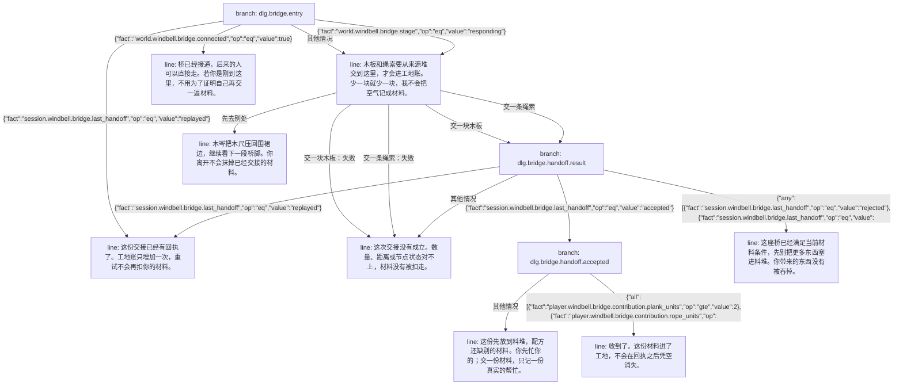

## dialogue.windbell.bridge.reunion

```mermaid
flowchart TD
  n0["branch: dlg.bridge.reunion.entry"]
  n0 -->|"其他情况"| n5
  n0 -->|"{&quot;all&quot;:[{&quot;fact&quot;:&quot;world.windbell.bridge.connected&quot;,&quot;op&quot;:&quot;eq&quot;,&quot;value&quot;:true},{&quot;fact&quot;:&quot;player.windbell.bridge.contribution.plank_units&quot;,&quot;op&quot;:&quot;gte&quot;,&quot;value&quot;"| n1
  n0 -->|"{&quot;all&quot;:[{&quot;fact&quot;:&quot;world.windbell.bridge.connected&quot;,&quot;op&quot;:&quot;eq&quot;,&quot;value&quot;:true},{&quot;fact&quot;:&quot;memory.npc.craftsman.mu_cen.player.material_handoff_seen&quot;,&quot;op&quot;:&quot;eq&quot;"| n2
  n0 -->|"{&quot;all&quot;:[{&quot;fact&quot;:&quot;world.windbell.bridge.connected&quot;,&quot;op&quot;:&quot;eq&quot;,&quot;value&quot;:true},{&quot;fact&quot;:&quot;memory.npc.craftsman.mu_cen.player.material_handoff_seen&quot;,&quot;op&quot;:&quot;eq&quot;"| n3
  n0 -->|"{&quot;fact&quot;:&quot;memory.npc.craftsman.mu_cen.player.material_handoff_seen&quot;,&quot;op&quot;:&quot;eq&quot;,&quot;value&quot;:true}"| n4
  n1["line: 你交来的木板和绳索都进了桥的骨架。桥不是一个人建成的，但每一份材料都有去处。"]
  n2["line: 我记得你在工地交过材料，后来它们用进了桥段。你可以直接走，不必再领取一份“完成”。"]
  n3["line: 你来得晚，这座桥已经能走。请便；我不会把别人的交接算到没有见过的人身上。"]
  n4["line: 你交来的那份还在工地账上，桥正在一段段装。先完成的工作不会因为你离开就倒回去。"]
  n5["line: 桥还在按材料和工序往前走。你若只是路过，照自己的路走就好。"]
```

## dialogue.windbell.bridge.life_after_arrival

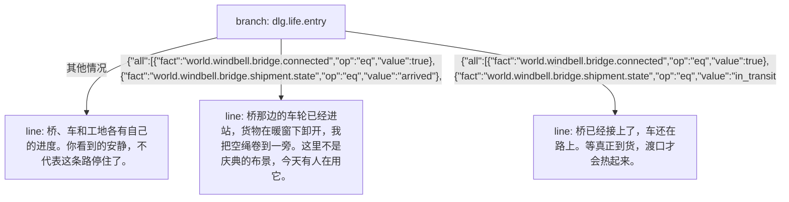

## dialogue.windbell.island.arrival_paths

```mermaid
flowchart TD
  n0["branch: dlg.island.entry"]
  n0 -->|"其他情况"| n1
  n0 -->|"{&quot;fact&quot;:&quot;player.windbell.island.arrived&quot;,&quot;op&quot;:&quot;eq&quot;,&quot;value&quot;:true}"| n13
  n0 -->|"{&quot;fact&quot;:&quot;session.windbell.island.last_arrival&quot;,&quot;op&quot;:&quot;eq&quot;,&quot;value&quot;:&quot;failed&quot;}"| n15
  n1["line: 你能看见岛上的暖窗，但我不会替你选路。根道一直在，绳索可以改变树桥，干枝和叶翼也许能借来一小段上升的风。"]
  n1 -->|"沿石脊根道上去"| n9
  n1 -->|"沿石脊根道上去：失败"| n15
  n1 -->|"切断树桥支撑绳"| n2
  n1 -->|"切断树桥支撑绳：失败"| n15
  n1 -->|"给干枝加热"| n5
  n1 -->|"给干枝加热：失败"| n15
  n2["branch: dlg.island.bridge.cut_result"]
  n2 -->|"其他情况"| n15
  n2 -->|"{&quot;fact&quot;:&quot;world.windbell.island.tree_bridge.state&quot;,&quot;op&quot;:&quot;eq&quot;,&quot;value&quot;:&quot;landed&quot;}"| n3
  n2 -->|"{&quot;fact&quot;:&quot;world.windbell.island.tree_bridge.state&quot;,&quot;op&quot;:&quot;eq&quot;,&quot;value&quot;:&quot;released&quot;}"| n4
  n3["line: 绳索松开，树桥落在止挡上了。它现在是一条真实的路，先前的断口没有被回放覆盖。"]
  n3 -->|"走上落稳的树桥"| n9
  n3 -->|"走上落稳的树桥：失败"| n15
  n4["line: 支撑已经释放，桥还在落位。等它碰到止挡再走；现在上去只会把一次尝试变成跌落。"]
  n4 -->|"等桥落稳"| n2
  n5["branch: dlg.island.fire.ignite_result"]
  n5 -->|"其他情况"| n15
  n5 -->|"{&quot;fact&quot;:&quot;world.windbell.island.heat_field.state&quot;,&quot;op&quot;:&quot;eq&quot;,&quot;value&quot;:&quot;active&quot;}"| n6
  n5 -->|"{&quot;fact&quot;:&quot;world.windbell.island.dry_branch.state&quot;,&quot;op&quot;:&quot;eq&quot;,&quot;value&quot;:&quot;spent&quot;}"| n8
  n6["line: 干枝先亮起来，落叶才往上走。叶翼张开时能借这股短风；火不是传送门，燃料用完，热流也会停。"]
  n6 -->|"展开旅行叶翼"| n7
  n6 -->|"展开旅行叶翼：失败"| n15
  n7["line: 叶翼接住了上升的风。看准落脚点再起跳，若火熄了，就换一条路；根道不会因为你试过借火而消失。"]
  n7 -->|"借热流抵达驿站"| n9
  n7 -->|"借热流抵达驿站：失败"| n15
  n8["line: 余烬已经冷下来，刚才的热流没有被重播。你仍然可以走根道，或等树桥落稳。"]
  n9["branch: dlg.island.arrival.result"]
  n9 -->|"其他情况"| n15
  n9 -->|"{&quot;fact&quot;:&quot;session.windbell.island.last_arrival&quot;,&quot;op&quot;:&quot;eq&quot;,&quot;value&quot;:&quot;root_path&quot;}"| n10
  n9 -->|"{&quot;fact&quot;:&quot;session.windbell.island.last_arrival&quot;,&quot;op&quot;:&quot;eq&quot;,&quot;value&quot;:&quot;bridge_path&quot;}"| n11
  n9 -->|"{&quot;fact&quot;:&quot;session.windbell.island.last_arrival&quot;,&quot;op&quot;:&quot;eq&quot;,&quot;value&quot;:&quot;fire_path&quot;}"| n12
  n9 -->|"{&quot;fact&quot;:&quot;session.windbell.island.last_arrival&quot;,&quot;op&quot;:&quot;eq&quot;,&quot;value&quot;:&quot;replayed&quot;}"| n16
  n10["line: 你从根道上来了。石脊没有发光，也没有把你送来；是你看见了可站的地方，一步步走到了这里。"]
  n11["line: 你踩着刚落稳的树桥过来了。桥的另一端也会记得这次改变，但它不属于某一个人的私人道路。"]
  n12["line: 你从热流里落下，叶翼上还留着一点温度。火已经完成它能做的事，接下来这座岛不会要求你重复点燃它。"]
  n13["branch: dlg.island.reunion"]
  n13 -->|"其他情况"| n14
  n13 -->|"{&quot;fact&quot;:&quot;memory.npc.bellkeeper.lan_zhi.player.arrival_path&quot;,&quot;op&quot;:&quot;eq&quot;,&quot;value&quot;:&quot;root_path&quot;}"| n10
  n13 -->|"{&quot;fact&quot;:&quot;memory.npc.bellkeeper.lan_zhi.player.arrival_path&quot;,&quot;op&quot;:&quot;eq&quot;,&quot;value&quot;:&quot;bridge_path&quot;}"| n11
  n13 -->|"{&quot;fact&quot;:&quot;memory.npc.bellkeeper.lan_zhi.player.arrival_path&quot;,&quot;op&quot;:&quot;eq&quot;,&quot;value&quot;:&quot;fire_path&quot;}"| n12
  n14["line: 欢迎来到风铃岛。这里的风和铃声都还在工作，你若愿意，可以再看一遍自己走过的路。"]
  n15["line: 这次没有抵达。绳索可能还没落稳，火可能已经耗尽，或你的落脚不满足稳定条件。失败只说明这一尝试没成立，根道仍然在。"]
  n16["line: 这次到达已经登记过了。不会因为重连或重放，再把你送上岛一次。"]
```

## bt.npc.traveler.wei.cart_recovery

阿苇在玩家不参与或只完成部分帮助时，自行包扎、固定、扶车，并在桥通后运输。

```mermaid
flowchart TD
  b0["selector: bt.npc.traveler.wei.cart_recovery.root"]
  b1["sequence: bt.npc.traveler.wei.cart_recovery.bandage"]
  b2["condition: {&quot;fact&quot;:&quot;world.windbell.bridge.cart.driver.condition&quot;,&quot;op&quot;:&quot;eq&quot;,&quot;value&quot;:&quot;minor_injury&quot;}"]
  b1 --> b2
  b3["action: action.windbell.cart.self_rescue.bandage"]
  b1 --> b3
  b0 --> b1
  b4["sequence: bt.npc.traveler.wei.cart_recovery.secure"]
  b5["condition: {&quot;fact&quot;:&quot;world.windbell.bridge.cart.cargo.secured&quot;,&quot;op&quot;:&quot;eq&quot;,&quot;value&quot;:false}"]
  b4 --> b5
  b6["condition: {&quot;fact&quot;:&quot;world.windbell.bridge.cart.lookout.active&quot;,&quot;op&quot;:&quot;eq&quot;,&quot;value&quot;:false}"]
  b4 --> b6
  b7["action: action.windbell.cart.self_rescue.secure"]
  b4 --> b7
  b0 --> b4
  b8["sequence: bt.npc.traveler.wei.cart_recovery.brace"]
  b9["condition: {&quot;fact&quot;:&quot;world.windbell.bridge.cart.pose&quot;,&quot;op&quot;:&quot;eq&quot;,&quot;value&quot;:&quot;tilted&quot;}"]
  b8 --> b9
  b10["condition: {&quot;fact&quot;:&quot;world.windbell.bridge.cart.cargo.secured&quot;,&quot;op&quot;:&quot;eq&quot;,&quot;value&quot;:true}"]
  b8 --> b10
  b11["action: action.windbell.cart.self_rescue.brace"]
  b8 --> b11
  b0 --> b8
  b12["sequence: bt.npc.traveler.wei.cart_recovery.depart"]
  b13["condition: {&quot;fact&quot;:&quot;world.windbell.bridge.cart.mobility&quot;,&quot;op&quot;:&quot;eq&quot;,&quot;value&quot;:&quot;ready&quot;}"]
  b12 --> b13
  b14["condition: {&quot;fact&quot;:&quot;world.windbell.bridge.shipment.state&quot;,&quot;op&quot;:&quot;eq&quot;,&quot;value&quot;:&quot;stopped&quot;}"]
  b12 --> b14
  b15["action: action.windbell.cart.depart"]
  b12 --> b15
  b0 --> b12
  b16["sequence: bt.npc.traveler.wei.cart_recovery.arrive"]
  b17["condition: {&quot;fact&quot;:&quot;world.windbell.bridge.shipment.state&quot;,&quot;op&quot;:&quot;eq&quot;,&quot;value&quot;:&quot;in_transit&quot;}"]
  b16 --> b17
  b18["action: action.windbell.cart.arrive"]
  b16 --> b18
  b0 --> b16
  b19["wait: bt.npc.traveler.wei.cart_recovery.wait"]
  b0 --> b19
```

## bt.npc.craftsman.mu_cen.bridge_build

木岑按真实工地库存顺序安装三个桥段，材料不足时等待或接受新的交接。

```mermaid
flowchart TD
  b0["selector: bt.npc.craftsman.mu_cen.bridge_build.root"]
  b1["sequence: bt.npc.craftsman.mu_cen.install.01"]
  b2["condition: {&quot;fact&quot;:&quot;world.windbell.bridge.segment.01.status&quot;,&quot;op&quot;:&quot;eq&quot;,&quot;value&quot;:&quot;missing&quot;}"]
  b1 --> b2
  b3["condition: {&quot;fact&quot;:&quot;world.windbell.bridge.material.site.planks&quot;,&quot;op&quot;:&quot;gte&quot;,&quot;value&quot;:2}"]
  b1 --> b3
  b4["condition: {&quot;fact&quot;:&quot;world.windbell.bridge.material.site.rope&quot;,&quot;op&quot;:&quot;gte&quot;,&quot;value&quot;:1}"]
  b1 --> b4
  b5["action: action.windbell.bridge.install.segment.01"]
  b1 --> b5
  b0 --> b1
  b6["sequence: bt.npc.craftsman.mu_cen.install.02"]
  b7["condition: {&quot;fact&quot;:&quot;world.windbell.bridge.segment.01.status&quot;,&quot;op&quot;:&quot;eq&quot;,&quot;value&quot;:&quot;installed&quot;}"]
  b6 --> b7
  b8["condition: {&quot;fact&quot;:&quot;world.windbell.bridge.segment.02.status&quot;,&quot;op&quot;:&quot;eq&quot;,&quot;value&quot;:&quot;missing&quot;}"]
  b6 --> b8
  b9["condition: {&quot;fact&quot;:&quot;world.windbell.bridge.material.site.planks&quot;,&quot;op&quot;:&quot;gte&quot;,&quot;value&quot;:2}"]
  b6 --> b9
  b10["condition: {&quot;fact&quot;:&quot;world.windbell.bridge.material.site.rope&quot;,&quot;op&quot;:&quot;gte&quot;,&quot;value&quot;:1}"]
  b6 --> b10
  b11["action: action.windbell.bridge.install.segment.02"]
  b6 --> b11
  b0 --> b6
  b12["sequence: bt.npc.craftsman.mu_cen.install.03"]
  b13["condition: {&quot;fact&quot;:&quot;world.windbell.bridge.segment.02.status&quot;,&quot;op&quot;:&quot;eq&quot;,&quot;value&quot;:&quot;installed&quot;}"]
  b12 --> b13
  b14["condition: {&quot;fact&quot;:&quot;world.windbell.bridge.segment.03.status&quot;,&quot;op&quot;:&quot;eq&quot;,&quot;value&quot;:&quot;missing&quot;}"]
  b12 --> b14
  b15["condition: {&quot;fact&quot;:&quot;world.windbell.bridge.material.site.planks&quot;,&quot;op&quot;:&quot;gte&quot;,&quot;value&quot;:2}"]
  b12 --> b15
  b16["condition: {&quot;fact&quot;:&quot;world.windbell.bridge.material.site.rope&quot;,&quot;op&quot;:&quot;gte&quot;,&quot;value&quot;:1}"]
  b12 --> b16
  b17["action: action.windbell.bridge.install.segment.03"]
  b12 --> b17
  b0 --> b12
  b18["sequence: bt.npc.craftsman.mu_cen.shelter"]
  b19["condition: {&quot;fact&quot;:&quot;world.windbell.bridge.shipment.state&quot;,&quot;op&quot;:&quot;eq&quot;,&quot;value&quot;:&quot;arrived&quot;}"]
  b18 --> b19
  b20["condition: {&quot;fact&quot;:&quot;world.windbell.bridge.connected&quot;,&quot;op&quot;:&quot;eq&quot;,&quot;value&quot;:true}"]
  b18 --> b20
  b21["condition: {&quot;fact&quot;:&quot;world.windbell.bridge.shelter.status&quot;,&quot;op&quot;:&quot;eq&quot;,&quot;value&quot;:&quot;none&quot;}"]
  b18 --> b21
  b22["action: action.windbell.bridge.establish.shelter"]
  b18 --> b22
  b0 --> b18
  b23["wait: bt.npc.craftsman.mu_cen.wait"]
  b0 --> b23
```

## bt.world.windbell.island.structure_and_fire

将玩家已经造成的支撑失效或燃料耗尽推进为有限、可重建的场景事实。

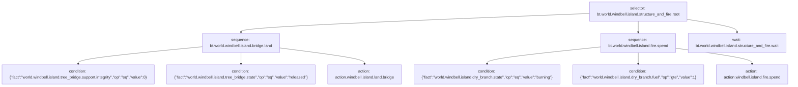

## bt.world.windbell.island.sky.dragon_patrol

让巡风龙按自己的远景航线经历巡游、翼拍、停歇、再巡游；不制造救援、任务或到达前置。

```mermaid
flowchart TD
  b0["selector: bt.world.windbell.island.sky.dragon_patrol.root"]
  b1["sequence: bt.world.windbell.island.sky.dragon.step"]
  b2["condition: {&quot;fact&quot;:&quot;world.windbell.island.sky.dragon.state&quot;,&quot;op&quot;:&quot;eq&quot;,&quot;value&quot;:&quot;patrolling&quot;}"]
  b1 --> b2
  b3["condition: {&quot;fact&quot;:&quot;world.windbell.island.sky.dragon.route_progress&quot;,&quot;op&quot;:&quot;lt&quot;,&quot;value&quot;:2}"]
  b1 --> b3
  b4["action: action.windbell.island.dragon.patrol_step"]
  b1 --> b4
  b0 --> b1
  b5["sequence: bt.world.windbell.island.sky.dragon.wingbeat"]
  b6["condition: {&quot;fact&quot;:&quot;world.windbell.island.sky.dragon.route_progress&quot;,&quot;op&quot;:&quot;gte&quot;,&quot;value&quot;:2}"]
  b5 --> b6
  b7["condition: {&quot;fact&quot;:&quot;world.windbell.island.sky.dragon.state&quot;,&quot;op&quot;:&quot;eq&quot;,&quot;value&quot;:&quot;patrolling&quot;}"]
  b5 --> b7
  b8["action: action.windbell.island.dragon.wingbeat"]
  b5 --> b8
  b0 --> b5
  b9["sequence: bt.world.windbell.island.sky.dragon.rest"]
  b10["condition: {&quot;fact&quot;:&quot;world.windbell.island.sky.dragon.state&quot;,&quot;op&quot;:&quot;eq&quot;,&quot;value&quot;:&quot;wingbeat&quot;}"]
  b9 --> b10
  b11["action: action.windbell.island.dragon.rest"]
  b9 --> b11
  b0 --> b9
  b12["sequence: bt.world.windbell.island.sky.dragon.resume"]
  b13["condition: {&quot;fact&quot;:&quot;world.windbell.island.sky.dragon.state&quot;,&quot;op&quot;:&quot;eq&quot;,&quot;value&quot;:&quot;resting&quot;}"]
  b12 --> b13
  b14["action: action.windbell.island.dragon.resume"]
  b12 --> b14
  b0 --> b12
  b15["wait: bt.world.windbell.island.sky.dragon.wait"]
  b0 --> b15
```

## bt.npc.bellkeeper.lan_zhi.island_life

岚织在当前岛屿实例完成有限修铃，并观察已经抵达的来客；桥上生活由木岑的公共桥行为树拥有。

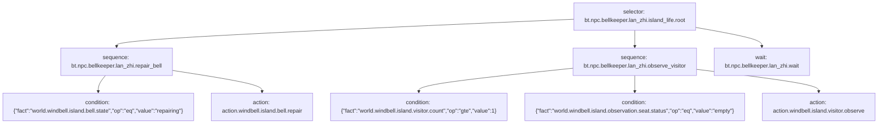

