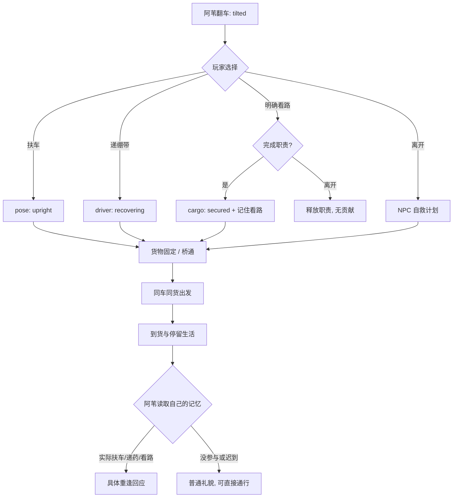

# 风铃桥／风铃岛叙事包 v0.1

状态：首期内容规格与离线可验证数据，未接入生产游戏代码。  
来源：`P`（本项目原创）；冒险岛的横向冒险、明快轮廓和节奏只作风格参考，不把本包冒称 TMS273 原作剧情、角色或机制。

## 1. 首期边界

本包只交付一条公共桥的恢复生活链和一座个人到达岛屿的短场景。公共桥的事实对同一世界连续体一致；角色与 NPC 的记忆按真实目击者区分。玩家可以离开，NPC 可以在有限计划内自救、施工和运输；没有参与不会变成道德标签。

首期验证的核心因果是：

```text
真实行动 → 具体事实变化 → 目击者获得有限记忆 → 当场或重逢时相称回应
```

首期不做天命等级、人格分数、全知 NPC、全村传闻、在线 LLM、排行榜、每日维护、强制任务、权柄或后续角色道路。一次扶车或一次到达只证明“这件事被看见”，不自动给玩家贴上守护者、传火者等身份。

## 2. 人物与立绘固定稿

| 稳定 ID | 名称／职责 | 服装与剪影 | 亲眼知道什么 | 状态 |
|---|---|---|---|---|
| `npc.traveler.wei` | 阿苇，旅人兼小型货车车主 | 芦灰短斗篷和窄兜帽，青绿色短上衣，赭黄腰带，深棕短靴，米白货单袋；中性青年，常一手扶车辕 | 自己的车、伤势、货物，以及亲眼看见的扶车、绷带、看路 | 首期 |
| `npc.craftsman.mu_cen` | 木岑，风铃桥修桥工匠 | 深青无袖工装背心，赭色厚围裙，深褐卷边工装裤，帆布手套；宽背、腰挂木尺和红绳线轴 | 工地材料交接、数量、桥段安装与公共通路 | 首期 |
| `npc.bellkeeper.lan_zhi` | 岚织，风铃岛修铃人 | 雾蓝短外套，米白高领内衫，浅青窄围巾，铜色工具腰包，墨青低马尾，耳侧小铜铃 | 在岛上亲眼看见角色从根道、树桥或热流抵达 | 首期 |

旧草稿曾把旅人暂名为“阿榆”。这不是第二位旅人；生产 ID 与显示名固定为 `npc.traveler.wei`／阿苇，避免出现两辆车、两份货物或两套记忆。

后续只登记、不参与首期数据：

| 稳定 ID | 名称 | 进入条件 |
|---|---|---|
| `npc.archive_keeper.huaisheng` | 槐生，守藏者 | 玩家真实保留、转述或找回公共历史后再设计 |
| `npc.firebearer.jinhe` | 烬禾，传火者 | 不同场景的火与承担规则通过验证后再设计 |

更完整的颜色、道具、表情、姿态和内置图像工具提示词在 [`characters.json`](../../../../resources/creative/windbell/narrative/characters.json)；图像生成不能把“冒险岛风格”变成现有角色复制。

## 3. 场景一：风铃桥渡口

### 3.1 现场事实

阿苇的车轮卡在沟沿，车身侧倾但没有断轴；货物未固定，阿苇是轻伤；道路仍可通行，车上急救包有两条绷带。桥侧工地有六块木板、三条绳索，三段桥每段消耗两块木板和一条绳索。桥的公共阶段由实际库存、安装事实、同一货单到货和停留点推导，不接受客户端直接写 `stage`、`openBridge` 或 `spawnCaravan`。

### 3.2 玩家入口

玩家可以在同一处选择扶车、递绷带、明确接手一小段看路、交接木板或绳索，也可以观察后离开。扶车和材料交接的作用必须由服务端以稳定 `requestId` 校验；抬手动画不是成功事实。看路只有在明确接手、实际让阿苇完成固定工作后才形成贡献；中途离开会释放职责，不能把附近挂机算作劳动。

### 3.3 NPC 自主推进

没有玩家帮助时，阿苇和同行者按有限行为树自行包扎、固定货物、扶正车辆；木岑按工地库存依次安装桥段；桥通后同一车、同一货单才出发并到货。离线只按持久化的计划时刻推进，不能把离线时间算成玩家协作。树中的每次唤醒最多执行一个动作，避免把完整社会模拟塞进首期。

### 3.4 重逢与公共生活

到货后阿苇在卸货处出现，木岑能谈桥段、材料去处和桥边停留点；岚织只负责岛屿实例内的修铃、观景位和到达来客。参与者听到有来源的具体回应；晚到或没参与的人照常走桥，得到普通招呼；不把别人的功劳归给路人，也不要求路人补做建设。桥到货与否不会成为岚织开始岛上生活的前置。

## 4. 场景二：风铃岛开场

风铃岛是从树根和云层上方可见的原创地点。岛上物理事实属于当前个人／小队 `instance`，与风铃桥的 `shared` 公共事实分开。首期提供三个到达分支，同一目的地、不同因果：

| 路径 | 事实链 | 岚织在驿站能说什么 |
|---|---|---|
| 根道 | 根道开放 → 角色形成稳定落脚 → `arrived.root` | “你从根道上来了。石脊没有替你走路。” |
| 放桥 | 切断适用支撑绳 → 树桥释放 → 落到止挡 → `arrived.bridge` | “你踩着刚落稳的树桥过来了。” |
| 借火 | 干枝达到热量阈值 → 有限热流 → 展开叶翼 → `arrived.fire` | “你从热流里落下，叶翼还留着一点温度。” |

根道永远是可回退的稳定路线；桥和热流是当前岛屿实例的场景规则，不是职业颜色门。即使风铃桥尚未修复，根道仍然开放，玩家抵达后仍可与岚织交谈。火的燃料耗尽后不会为新玩家重播，失败只记录本次遭遇结果并保留其它路径。到达判定由稳定落脚事实产生，不以固定秒数、职业名或杀怪数量为条件。

巡风龙只作远景循环：`patrolling` → 两个离散航线步进 → `wingbeat`（轻量阵风）→ `resting`（高位枝停歇）→ `patrolling`。这四个动作由岛屿实例自己的有限行为树按一次唤醒一个动作推进，既不救援玩家，也不作为任一路径的到达或桥修复前置。

## 5. 分支与行为树预览

对白完整树在 [`dialogue.json`](../../../../resources/creative/windbell/narrative/dialogue.json)，包括扶车、交接、当场成功／失败／重放、部分帮助、离开、迟到、重逢、NPC 自救、桥通到货生活和三条岛上路径。



行为树只表达事实条件、有限动作和重放边界，见 [`behavior_trees.json`](../../../../resources/creative/windbell/narrative/behavior_trees.json)。每个 `condition.fact` 必须在 [`facts.json`](../../../../resources/creative/windbell/narrative/facts.json) 存在；每个动作引用一个稳定 `actionId` 和 `effectId`，事件来源、作用对象、范围与重放规则不能藏在对白里。木岑的桥行为树读取 `shared` 桥事实；岚织和巡风龙只读取 `instance` 岛屿事实。

## 6. 事实、记忆与对白规则

事实分为 `shared`、`instance`、`personal`、`encounter`：

- `shared` 是同一世界连续体的公共现实，例如车是否扶正、材料是否从来源到工地、桥段是否安装、货物是否到货。
- `instance` 是当前个人／小队岛屿实例的物理现实，例如树桥是否落稳、枯枝热流、风铃修理、观景位来客和巡风龙远景姿态；它不能与公共桥共用一个全局物理值。
- `personal` 记录认证角色的真实贡献或岛上到达路径。它不能改变同一座公共桥的碰撞和阶段。
- `encounter` 只用于当前回执、失败和重放表现；它不能沉淀为“这个人冷漠”的长期属性。

记忆键含 NPC 身份和角色主体，例如 `memory.npc.traveler.wei.player.cart_braced`。阿苇不自动知道木岑收到的材料；岚织不自动知道玩家没有在岛上看见的旧事。未来若要传播，必须新增有说话者、接收者和来源事件的传播记录，首期不做。

文案遵守五个检查：

1. 来源明确，台词能追到事实或事件。
2. 知情者正确，未目击者不点名。
3. 尺度相称，一块木板不会变成“全靠你建成”。
4. 失败、离开和重放有自己的事实语义，不伪造成功。
5. 没参与仍有正常公共资格，没有道德债或补做压力。

## 7. 交付和检查

资源包由四个数据文件组成：

| 文件 | 用途 |
|---|---|
| `characters.json` | 稳定 NPC 身份、服装剪影、声音和立绘提示词 |
| `facts.json` | 事实、事件、效应、动作、来源和重放契约 |
| `dialogue.json` | 有条件、有 actionId、有 sourceFacts 的中文分支对白 |
| `behavior_trees.json` | 阿苇、木岑、岚织和岛上有限世界行为树 |

在仓库根目录运行：

```text
python3 scripts/creative/check_windbell_narrative.py
python3 scripts/creative/check_windbell_narrative.py --demo
```

检查脚本只用 Python 标准库：验证 UTF-8 JSON、稳定 ID 唯一、角色引用、事实条件、事件／效应／动作关系、对白跳转和必需覆盖；它还拒绝岚织行为树引用公共桥事实，并检查所有岛屿世界事实保持 `instance` scope。`--demo` 用内存事实跑通“扶车—重逢”“不参与—NPC 自救”“交一块材料—部分帮助”“桥未修—根道抵达并与岚织交谈”“放桥／借火”和“巡游—翼拍—停歇—再巡游”关键分支。它是内容门禁和最小模拟器，不是生产运行时，也不修改服务、数据库或客户端。

## 8. 后续门

首期完成并通过真实运行验收后，才讨论：槐生的公共历史保存、烬禾的火之承担、更多传播者、第二种世界节点或地方权柄。后续内容必须先交付初始事实、自由入口、变化、知情者、回应来源、自主推进、反事实和持久性，不能仅增加台词数量或把首期路径重新命名为天命。
