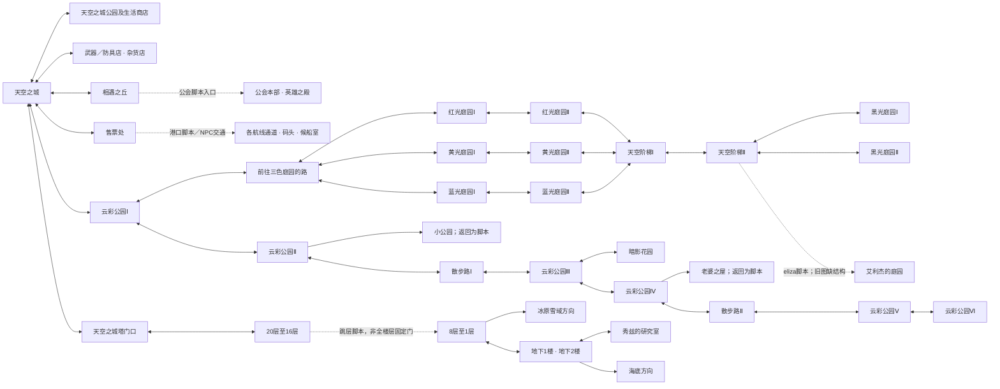

# 天空之城地图脉络与交织螺旋方案

2026-10-02。状态：原版取证、总分总图集与独立Blender结构白模完成；新城尚未完成美术与导航实装，未接入正式玩法。任务状态只维护[当前计划](../plan/PLAN.md)。用户已认可第三版天空船，城市更新保留船的外观；旧地图不能因连接资料缺失而被排除，内部空间需要时直接用Blender构建。

## 原版内容与证据

本地TMS273名称表提取天空之城本体80条：城镇/港口29、云彩公园/庭园24、天空之城塔27。另有雅典娜禁地/女神之塔27条历史名称。80条本体中71条有完整WZ结构、9条未找到结构；女神塔25条只剩缩略图、303号房与一张监狱仓库2共2条未找到结构。这些是源包状态，不是是否值得保留的取舍。

扩展总目录287条还包括航行122、跨地区移动16、两套克里塞区域名称35和克里塞组队目录7。航行表混有其他地区之间的航程和实例副本，不等于天空之城拥有287个独立城区。相同名字的不同地图ID均保留，不按名字合并丢失内容。

完整名称、每个地图的固定出口、脚本入口和证据状态：

- [完整名称与连接表](../../resources/scenes/sky-voyage-v3/references/orbis-map-topology-tms273.md)
- [机器可读源拓扑](../../resources/scenes/sky-voyage-v3/references/orbis-map-topology-tms273.json)
- [提取器](../../scripts/export_orbis_topology.cjs)，运行 `node scripts/export_orbis_topology.cjs`；复用现有WZ读取器，不改原包。脚本自检主城门户、三色汇合和20层/女神塔名称数量。

原版确有“公會本部<英雄之殿>”和“雅典娜禁地”的房间群；不能据“宫殿感”虚构一串原版宫殿名。官方背景说明天空之城是云上的妖精城与繁忙空港，天空塔供奉女神，通向冰原雪域，地下通向海底。[MapleSEA官方区域介绍](https://www.maplesea.com/info/map/ossyria)。社区对城镇、花园与塔的说明作为跨版辅助，不替代本地同版门户：[Orbis区域概述](https://maplestorywiki.net/w/Orbis)。

女神圣域也有故事来源：2013年KMS官方“女神的痕迹”指南描述暴雨后女神像后开启新的云路与神秘塔，过去统治天空之城的女神被困其中，需要恢复石像并救出女神。[Nexon官方女神的痕迹指南](https://maplestory.nexon.com/News/Update/325)。本轮可把远处神像/圣域作为可见目标、旧房间作为逐层探索内容；这是空间叙事取材，尚未新增解谜、任务、战斗或奖励。2010年官方更新记录已有女神之塔入口地形调整，进一步说明入口不能跨版直接套用。[官方更新](https://maplestory.nexon.com/News/Update/123)。

## 已验证的原版主脉络

图中实线是本地WZ的固定门户；虚线只表示已找到脚本入口或历史内容，不声称其脚本目的地已在本地证实。多个地图合并显示的框是阅读分组，完整有向出口在原始表中。

“天空塔15至9层、10层秘密之室、艾利杰的庭园”共9条在名称表存在但未找到结构。女神塔入口与房间内部原版关系仍需历史资料辅助；[女神塔房间目录](https://maplestorywiki.net/w/Remnant_of_the_Goddess/Maps)只作为跨版本内容参考，不把组队阶段顺序直接画成普通步行道路。

## 三条明路交织，第四条暗路穿腹

主轮廓采用错落台地围绕中空高庭院逐段螺旋上升，最高处是宫殿式女神圣域。码头在最低前景，城镇生活区在下部两侧；玩家在入城、第一庭院、上层桥等位置能重新看见冠顶目标。女神圣域的冠顶造型与位置是原创改编P；原版女神塔的身份、房间名字和故事资料继续保留。

三路从三色庭园分出，各自经历Ⅰ/Ⅱ内容区，再汇入天空阶梯。它们绕核心的方向、快慢和所在高度不同，通过两个共享庭院换路；其他相交处做上下桥或桥下廊，避免把所有交叉都变成平面十字路口。这两个新增共享庭院与捷径标P，原版三色分流/汇合骨架单独保存。

| 路线 | 内容与空间性格 | 交织方式 |
| --- | --- | --- |
| 红路 | 红光庭园Ⅰ/Ⅱ，日照台地与外侧大阶梯，目标轮廓最明确 | 先向外绕，再踏上中层石桥；在下层共享庭院可换黄路 |
| 黄路 | 黄光庭园Ⅰ/Ⅱ，柱廊、穿院与内侧较紧螺旋 | 穿过红路桥下；在上层共享庭院可换蓝路 |
| 蓝路 | 蓝光庭园Ⅰ/Ⅱ，水庭、外缘露台与跨空桥 | 先向下短折再持续上升，横跨内庭；桥下可发现暗路线索 |
| 隐藏第四路 | 旧廊/桥腹 → 暗影花园相关背坡 → 艾利杰庭园 → 圣域下部旧房间 | 从不同主路的夹层进入，串接三路的上下层；出口回天空阶梯Ⅱ或上层庭院，形成可往返的探索环 |

暗路是新的空间连接，不把“暗影花园原本与艾利杰庭园相连”写成原版事实。第一轮先把三明路与庭院连接做成立，暗路的完整地面和出口预留；入口外观、发现节奏后续雕琢，不用假门或不可走裂缝冒充路线。

云彩公园Ⅰ—Ⅵ与散步路Ⅰ/Ⅱ作为外缘较缓的长环，保持原版串联顺序；在3D改编中新增从末端回到上层庭院的连接，避免内容尽头只能原路折返。小公园、老婆之屋、暗影花园、人少的散步道均保留为环上的支庭/建筑/低层花园。英雄之殿在相遇之丘的较高独立露台，不抢最高圣域的主轮廓。

## 旧图的明确空间归属

| 原版内容 | 原型中的位置与补连接（P） |
| --- | --- |
| 天空塔20层至地下2楼 | 保持城底向下的大塔体；复活15—9层与10层秘密之室，通过内部螺旋楼梯和休息平台接通。8/16层现行脚本交通另留入口，不用经典楼梯冒充当前脚本实现。 |
| 塔的隐密房间、秘密之室、秀兹研究室 | 藏在对应层的壁厚/侧室，真实门洞连接；下部保留冰原雪域、海底方向的边界入口。 |
| 艾利杰的庭园 | 上层黑光庭园后侧的隐蔽露台，经第四路与天空阶梯Ⅱ相接；命名为原版，新增路线为P。 |
| 雅典娜禁地岔路、中央塔、女神之塔中央塔 | 冠顶圣域的入口庭院、主中庭及内部高厅，三个地图身份都有对应空间，不因“中央塔”近似而删名。 |
| 散步路、仓库、休息室、封印之室、向上通道 | 分布在圣域中庭的环廊与错层建筑，主路可到休息庭院，深处通过真实楼梯抵达上层。 |
| 301—304号房 | 圣域一翼的四间独立房，分别保留ID与入口；走廊有端部回出。 |
| 庭园、女神之祝福 | 上层花园与高处开放庭院，形成远处目标与抵达后的视野奖励。 |
| 罪人之室、监狱Ⅰ/Ⅱ/Ⅲ及各仓库、黑暗之室、宝物仓库、出口 | 圣域腹部旧层，沿第四路的内部支环组织；三个监狱与同名仓库各有空间身份，出口接回外庭，不新设奖励或组队规则。 |
| 疑问之塔离开图、废弃码头、旧候船室/码头副本 | 旧门厅、封闭码头侧廊或可进入候船区。实例地图ID与实体空间映射保留，不强迫每个航行实例成为一栋重复建筑。 |
| 两套克里塞与组队地图目录 | 邻接侧岛的后续内容分区；原型预留村落、总部、外缘、无法地带与竞技场/高塔。历史/实例ID对应区域和入口清单，保留全部内容，首轮不先堆满相似战斗房间。 |

内部按需直接在Blender建立可编辑楼板、墙、门洞、楼梯和庭院。先核看可达性、净空与遮挡，再细化模型；平面图中视觉相交的两层不自动获得导航连接。

## 画面和尺度草案

第一张为高处斜看的完整城市微缩原型：中空庭院可读，三条路通过红/金黄/蓝色花园及局部铺装识别，不把整条路涂成游乐场轨道；桥腹留出暗路的一小段可见线索。暖白石材、天蓝屋顶和少量金饰建立天空之城的识别。移轴轻用，保留所有主路、楼梯与门。

内置imagegen的[首版完整提示词](prototypes/sky-city-braided-prompt.md)保存了来源/改编边界、路线结构与尺度要求；图像只是方案推演，具体路段与室内连接由之后的Blender白模验证。

初始构图以约900×750m城域、0—110m台地高差、冠顶约170m为草案；已认可船长150m作为比例锚点。道路/桥约8—14m、共享庭院约40—70m，角色约1.7m仅作图像尺度参照。以上为P视觉草案，白模实看后调整，不改现有px/m、角色存档、导航或权威移动规则。

原型成立条件：码头到城镇明确，三明路都能指认出起点/中途换路/汇合点，至少一处上下交叉清楚，最高目标可识别，暗路线索存在，旧塔和女神房间具有空间归属。图像不证明真实可走；之后的白模需核对全部新增连接与代表性行走视角。

通用管线已补到[3D场景开发通用指南](../technical/3D场景开发通用指南.md)与现有场景skill；不新增第四份任务台账。

## 总分总图集与结构白模（2026-10-02）

[离线图集](../../resources/scenes/sky-voyage-v3/prototypes/city-atlas.html)按“分块总图→A/B生活、C/D/E庭园、F/G内部及H内容归属→分线总图”排列，另附道路落脚近景。两张总图和Blender共用[空间草案](../../resources/scenes/sky-voyage-v3/prototypes/sky-city-spatial-layout.json)；原版门户源另存，不被P路线反写。

- 八分区、37连接点、43条独立道路；三主路共享段只生成一次。所有287个地图ID有唯一归属；同名航行/PQ实例保留身份，不能按名字去重，也不等于287栋独立建筑。
- [Blender源](../../resources/scenes/sky-voyage-v3/prototypes/sky-city-spatial-prototype.blend)与[GLB](../../resources/scenes/sky-voyage-v3/prototypes/sky-city-spatial-prototype.glb)已有真实路面、平坦到达平台/接路段、陡梯封底、F区27个独立房间墙体与门洞、G区二十层及地下两层的螺旋井/休息平台、五类工艺房体量。H目前为入口与聚落庭占位，其余房间及G支室继续细建。
- 用户补充“约三十度斜路下方不可走、平台需留回主路余量”已纳入断面。暗路入口移远并留平坦接近段，陡段用阶梯/实体封底；坡道从平台外起坡，避免从落脚平台底下接路。普通落脚平台半径8m、共享庭院14m，生活/侧岛庭单独扩大。
- 本轮P草案：连续坡道≤12°、净空目标≥3.2m、台阶高≤0.18m且踏面≥0.28m。70/48/38m共轴平台剖面扣0.8m楼板后净空21.2/9.2m；此结果仅覆盖该剖面，不宣称全地图净空通过。内部螺旋在楼板开口中运行，转角先留平坦停留段。
- 图像负责氛围，几何负责结构；图论连通、GLB数据与源坐标一致已检查，角色碰撞/导航、跌落回路实玩、正式地图与完整材质尚未接入。局部共面使用1.5cm视觉偏移避免闪烁，正式碰撞网格需合并相接面。

复现：`python3 scripts/creative/build_sky_city_atlas.py --html`生成数据/总图/图集；`--check-model`核对实际GLB的源布局、37平台坐标、43道路、27房间、22塔层及陡梯禁行背衬。Blender脚本由主代理经现有MCP串行执行，未修改已认可船源或在线服务。
